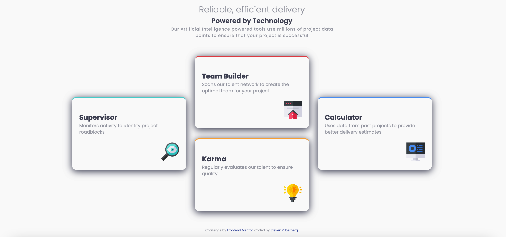

# Frontend Mentor - Four card feature section solution

[](https://app.netlify.com/sites/zealous-ptolemy-097c23/deploys)

This is a solution to the [Four card feature section challenge on Frontend Mentor](https://www.frontendmentor.io/challenges/four-card-feature-section-weK1eFYK). Frontend Mentor challenges help you improve your coding skills by building realistic projects. 

## Table of contents

- [Frontend Mentor - Four card feature section solution](#frontend-mentor---four-card-feature-section-solution)
  - [Table of contents](#table-of-contents)
  - [Overview](#overview)
    - [The challenge](#the-challenge)
    - [Screenshot](#screenshot)
    - [Links](#links)
  - [My process](#my-process)
    - [Built with](#built-with)
    - [What I learned](#what-i-learned)
  - [Author](#author)

## Overview

### The challenge

Users should be able to:

- View the optimal layout for the site depending on their device's screen size
- Make my design as close as possible to the Sketch/Figma designs

### Screenshot



### Links

- Solution URL: [Add solution URL here](https://github.com/srz2/FM-four-card-feature-section)
- Live Site URL: [Add live site URL here](https://zealous-ptolemy-097c23.netlify.app/)

## My process

I went mobile design first. I used basic HTML and CSS concepts.

I first separated our the page into two sections, the text at the top and the cards in the bottom. After copying the texts into their own sections, I actually started with the cards.

When it came time for the desktop version, used media queries to simply turn the *card-list* class into a flexbox and aligned the card accordingly. I also did a couple other changes to width which I'm not sure was needed or I designed incorrectly.

### Built with

- Semantic HTML5 markup
- CSS custom properties
- Flexbox
- Mobile-first workflow

### What I learned

I still have a ways to go to being proficent but recent projects I've done really helped in breaking down what I needed to do. This only took a couple hours where before I would easy spend a couple days (if not more on it).

I am starting to get the hang of flexbox which made going from mobile to deskto REALLY easy. I really need to get a better gasp on other CSS aspects though.

To see how you can add code snippets, see below:

I am glad instead of making myself crazy with CSS selectors, I simply just made the boarder colors its own class
```html
<div class="card-item border-red">
<div class="card-item border-blue">
```

I am very glad a while ago I discovered how to do variables which I used here
```css
:root {
    /* Primary Colors */
    --color_red: hsl(0, 78%, 62%);
    --color_cyan: hsl(180, 62%, 55%);
    --color_orange: hsl(34, 97%, 64%);
    --color_blue: hsl(212, 86%, 64%);

    /* Neutral Colors */
    --color_very-dark-blue: hsl(234, 12%, 34%);
    --color_grayish-blue: hsl(229, 6%, 66%);
    --color_very_light_gray: hsl(0, 0%, 98%);

    /* Card Item */
    --boarder-top-width: 4px;
}
```

## Author

- Github - [@srz2](https://github.com/srz2)
- Frontend Mentor - [@srz2](https://www.frontendmentor.io/profile/srz2)